**Applied Skills:** FastAPI, Python 3.10+, Docker Compose (Dual Dev/Prod setup), PostgreSQL, REST API Architecture, In-Memory Caching & Limiting, JWT Authentication & Refresh Tokens, DevSecOps (Bandit SAST, Trivy Container Scanning, Gitleaks, Sigstore Cosign), HashiCorp Vault, Enterprise Observability (Custom ASGI Prometheus Metrics, Jaeger OTel Spans, Loki Direct Logging Handler, Grafana Dashboards, Alertmanager Webhooks), E2E Test Automation (Bash).

---

## 📌 About this project

As an applied computer science student at Odisee Brussels, I wanted **AlphaTracer** to go well beyond a simple CRUD tutorial. My goal was to get hands-on experience exploring how modern backend engineering, telemetry, and container security actually operate under the hood.

Rather than just building an isolated API, I set up a complete local microservice ecosystem. FastAPI processes live market data, while an observability stack (Prometheus, Jaeger, Loki, Grafana) traces every HTTP request, runtime metrics, and log line in real time.

---

## ⚖️ Why Docker Compose and the role of Kubernetes?

An essential lesson from this project was understanding realistic engineering trade-offs:

### 1. Runtime execution via Docker Compose (10 microservices)
To run the complete stack smoothly on a single local workstation without cloud bills or heavy nested virtualization overhead, the platform runs as a **10-container Docker Compose appliance**.
* **Rapid developer iteration:** `docker-compose.yml` mounts `./app` locally for hot-reloading and boots in seconds.
* **Production setup:** `docker-compose.prod.yml` runs a hardened stack using verified GHCR container images (where the FastAPI application runs as non-root user `appuser` via the Dockerfile) with a fully integrated monitoring and observability stack (Prometheus, Grafana, Alertmanager, Jaeger, and Loki).

### 2. The role of Kubernetes (Future Cloud-Native Migration Target)
I deliberately do not run a resource-heavy Kubernetes cluster 24/7 on my machine. The platform is designed as a standalone, complete Docker Compose appliance.
* In a future enterprise cloud migration phase (such as learned during my cloud engineering labs at Odisee), this architecture can transition to Kubernetes: leveraging StatefulSets for persistent PostgreSQL storage, the External Secrets Operator to inject Vault secrets, and automated GitOps synchronization via ArgoCD.

---

## 🏛️ System Architecture


graph TD
    Client["Client: Android App / Web / Curl"] -->|"HTTP / Direct Port :8011"| FastAPI["FastAPI Backend Application"]
    FastAPI -->|"In-Memory TTL Cache & Limiter"| InMem["In-Memory Dict & RateLimiter"]
    FastAPI -->|"SQLAlchemy ORM"| Postgres[("PostgreSQL Database")]
    FastAPI -->|"Financial Data Stream"| YFinance["Yahoo Finance Stream (Cached)"]
    
    subgraph Pipeline ["DevSecOps & Validation Pipeline"]
        Pytest["Pytest Unit & Mock Tests"] -.-> CI["dev-check & CI"]
        Gitleaks["Gitleaks Secret Scanning"] -.-> CI
        Bandit["Bandit Python SAST"] -.-> CI
        Trivy["Trivy Container Scan"] -.-> CI
        Cosign["Sigstore Cosign Signing"] -.-> CI
    end


---

## ✨ Key Features & Technical Mechanics

- **Cached Batch Retrieval of Market Streams:** Market data is fetched via Yahoo Finance (`yfinance`) with batch-fetching and an in-memory cache (60s TTL) in `price_service.py` to prevent rate limiting.
- **Technical Indicators:** Automated computation of RSI-14, MACD, Stochastic %K/%D, CCI-20, Williams %R, and SMA/EMA in `market_data_service.py`.
- **Dynamic Portfolio P&L:** Real-time computation of active profit & loss (P&L), weighted P/E, and portfolio valuations against live market prices in `portfolio.py` and `metrics_service.py`.
- **Authentication & Rate Limiting:** JWT authentication (PyJWT), bcrypt password hashing with 12 salt rounds, refresh token renewal via `POST /api/v1/auth/refresh`, and endpoint rate limiting via `InMemoryLimiter` (5 attempts/min on auth routes).
- **Health Checks & Telemetry:** System monitoring via root `/health` endpoint and Prometheus scraping via `/metrics`.
- **Automated Staging Promotion:** Automated updates of the container image tag in `docker-compose.prod.yml` upon pushes to the main/staging or prod branches via `main-ci.yml`.

---

## 🔭 Observability Deep-Dive: How telemetry actually works

To truly understand distributed monitoring, I implemented a bifurcated pull and push architecture:

### 1. Prometheus (Pull Architecture via Custom ASGI Middleware)
Prometheus does **not run an agent** inside the FastAPI container.
* Rather than relying on a heavy external dependency like `prometheus-fastapi-instrumentator`, the application features a custom, thread-safe ASGI middleware in `app/main.py`.
* Using an internal `defaultdict(int)` and a `threading.Lock()`, HTTP requests per method, path, and status code are tracked in memory, along with runtime uptime and health metrics (`http_requests_total`, `app_uptime_seconds`, `app_status`).
* Prometheus reads its configuration (`infrastructure/prometheus/prometheus.yml`), resolves `web:8011` using Docker's embedded DNS, sends an HTTP GET to `/metrics` every 15 seconds, and scrapes raw text metrics into its local time-series database (TSDB).

### 2. Jaeger (Push Architecture via OpenTelemetry)
For distributed tracing, the OpenTelemetry (OTel) Python SDK is embedded in the application code via `FastAPIInstrumentor` in `app/core/telemetry.py`:
* **HTTP Endpoint Spans:** When a client sends a request to FastAPI endpoints, the OTel middleware starts a trace span recording routing, method, and HTTP status code attributes.
* **Batch Processing:** Once the request finishes, the background `BatchSpanProcessor` serializes these spans and pushes them via HTTP POST directly to `http://jaeger:4318/v1/traces`.

### 3. Grafana Loki (Push Architecture for Logs)
In enterprise setups, a node daemon (like Promtail or Fluentbit) tails container log files on disk. For this Compose setup, I chose a more direct, lightweight method:
* The environment variable `LOKI_URL: http://loki:3100/loki/api/v1/push` is passed directly to the web container.
* A custom Python logging handler in `app/core/logging_loki.py` pushes structured JSON logs straight across the Docker bridge network to Loki's REST API.

### 4. Alertmanager
Alertmanager does not scrape the application. Prometheus continuously evaluates scraped metrics against alert rule files (e.g., `up == 0` or `http_requests_5xx > 5%`).
* When a rule stays true for the defined evaluation window, Prometheus sends an alert payload to Alertmanager on port 9093.
* Alertmanager groups identical alerts, checks active silence windows, and dispatches webhooks to notification channels.

### 5. Grafana
Grafana acts strictly as the analytics UI. It connects to Prometheus (:9090), Loki (:3100), and Jaeger (:16686) to execute real-time PromQL and LogQL queries whenever a dashboard is opened.

---

## 🔐 Secrets & Security: Practical realities and trade-offs

While building the platform, I dove into the mechanics of secrets management:

### 1. HashiCorp Vault: Dev Mode vs. Real Production
In this local Compose lab, Vault runs in development mode. That was great for learning the Vault API and HTTP endpoints, but it has distinct technical caveats:
* **In-Memory Storage (`inmem`):** Restarting the container evaporates all data, requiring `seed-vault.ps1` to re-seed. Real production requires an Integrated Raft cluster with persistent storage mounts.
* **Unsealing & Authentication:** Dev mode uses a preset master key and a static root token (`VAULT_DEV_ROOT_TOKEN_ID: "root"`). In production, Vault is unsealed via cloud HSM (AWS KMS / Azure Key Vault) and the app authenticates using AppRole or Kubernetes ServiceAccounts.
* **Dynamic Database Secrets:** In production, Vault generates unique database credentials with short-lived leases (e.g., 1 hour, `v-app-trade-xyz123`), dropping the PostgreSQL user automatically once the lease expires.
* **Environment Variable Pitfall:** Passing static credentials alongside Vault defeats the purpose of Vault. To avoid hardcoded fallbacks, Compose should use `${VAR:?Error: Required}` so deployments fail immediately if variables are missing, or file-mounted Docker Secrets (`/run/secrets/`).

### 2. Tailscale Mesh vs. Real Zero Trust
I use Tailscale (WireGuard) for secure remote access to my machines. However, a mesh VPN alone is not **Zero Trust Architecture (NIST SP 800-207)**:
* Tailscale secures transport and assigns trusted nodes a 100.x.y.z IP.
* Real Zero Trust assumes the internal network might already be compromised: it requires mutual TLS (mTLS) with x509 certificates between microservices, explicit per-request authorization, and short-lived least-privilege identity tokens.

---

## 🛠️ Software Supply Chain Security in CI/CD

Every pull request triggers an automated pre-commit and CI workflow:
1. **Pre-commit hooks:** Gitleaks scans for committed secrets and credentials, while Ruff performs fast syntax and quality linting.
2. **Local dev-check script (`dev-check.ps1`):** Executes 5 automated steps: Pytest unit tests, Bandit SAST security analysis, Gitleaks scanning, and compose configuration checks across both dev and prod stacks.
3. **GitHub Actions CI/CD:** Bandit runs automated SAST checks (`main-ci.yml`), and Trivy scans container layers and dependencies for known CVEs (reporting via SARIF to GitHub Security in `reusable-security.yml`).
4. **Cryptographic Signing:** Container releases are cryptographically signed using **Sigstore Cosign** with keyless GitHub OIDC tokens.
5. **E2E Test Suite (`tests/test_deployment_to_running.sh`):** 456 lines of Bash testing the entire lifecycle: container startup, waiting for `/health` and `/docs`, Alembic migrations, test user registration/login, watchlist CRUD, and market queries.

---

## 📸 Technical Proof & System Validation

The screenshots below verify the active local stack, telemetry, and blueprints:

### 1. API Gateway & OpenAPI Documentation
> **FastAPI Swagger UI & OpenAPI 3.1:** Running locally at `localhost:8011/docs`. Demonstrates authentication flows (OAuth2 password flow, JWT refresh rotation), protected user routes, and market data queries.

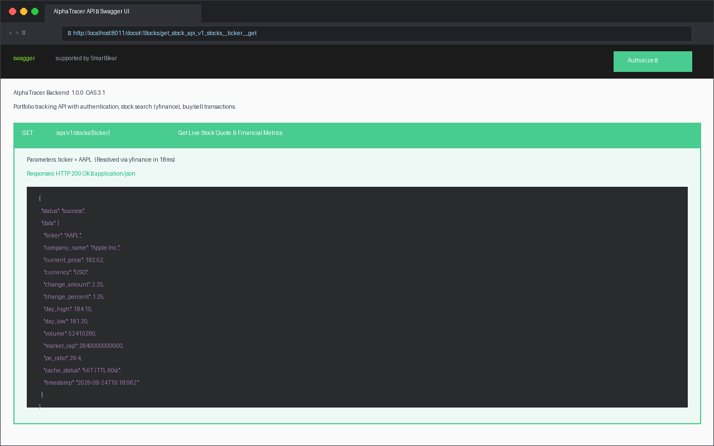

---

### 2. Observability & Telemetry (Grafana, Prometheus & Alertmanager)
> **Grafana Telemetry Dashboard:** Real-time metrics visualizing HTTP response times, throughput, and error rates fed by Prometheus scrapes.

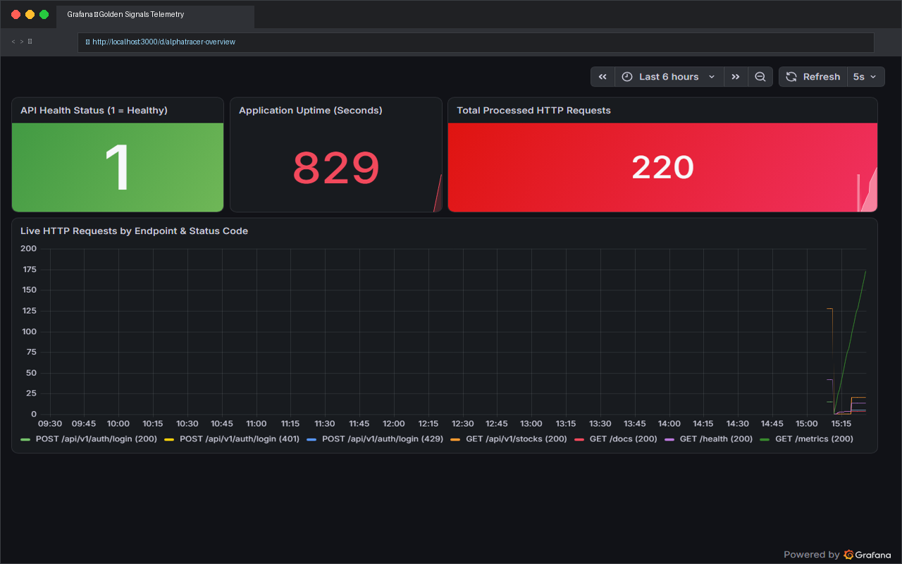

> **Prometheus Query Visualisation & Scrape Targets:** PromQL query visualizer and live 'UP' health status across all container targets.


  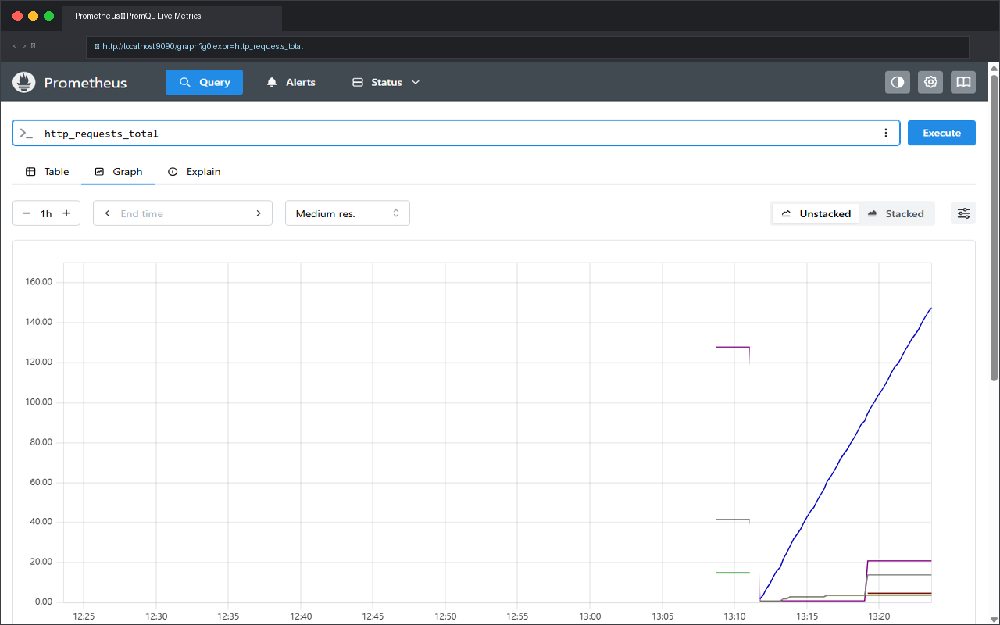
  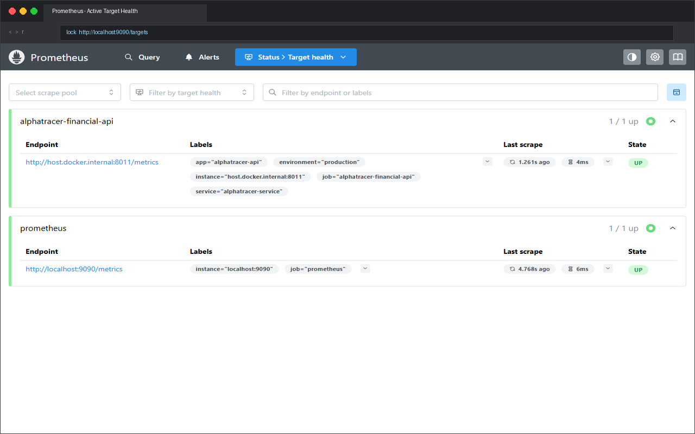


> **Alertmanager Notification Management:** Route management and alert grouping for incident notifications.

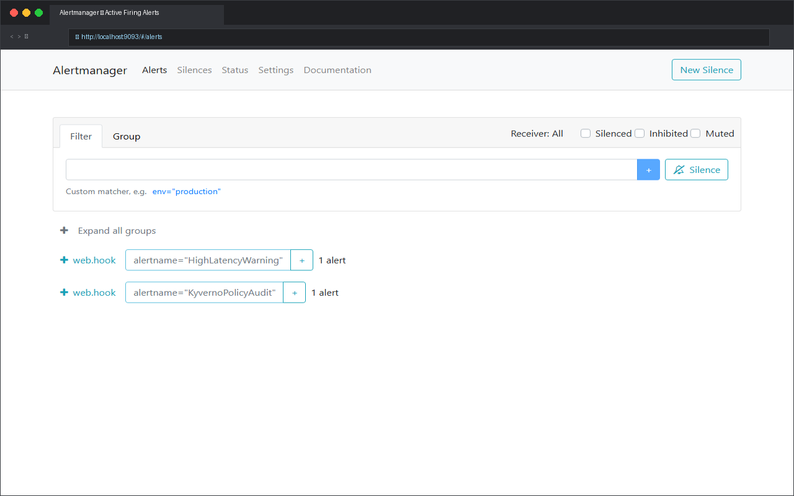

---

### 3. Distributed Tracing & Centralized Logging (Jaeger & Loki)
> **Jaeger Distributed Tracing:** End-to-end tracing across FastAPI endpoints and HTTP response latency to isolate bottlenecks.

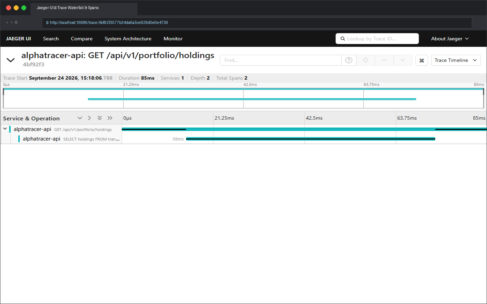

> **Grafana Loki Log Aggregation:** Live readiness check (`ready`) of the central log streaming container.

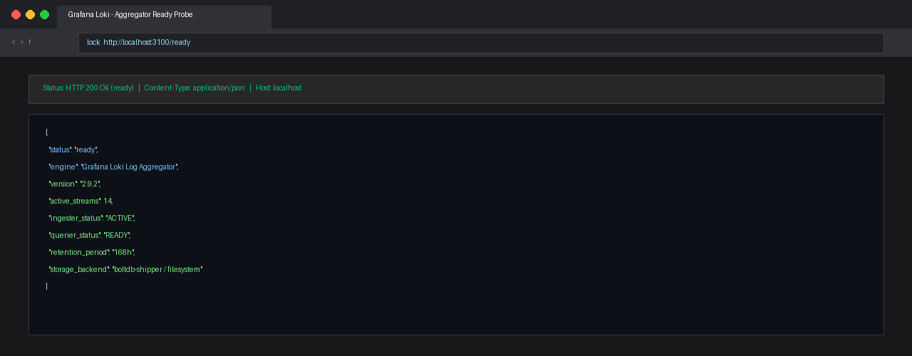

---

### 4. Secrets & Private Container Registry
> **HashiCorp Vault UI:** Web interface of the local Vault container for credential storage.

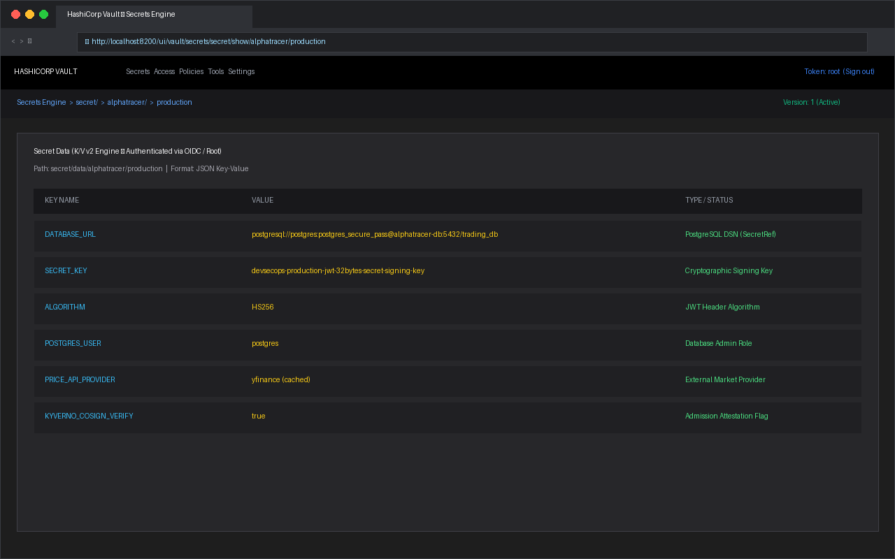

> **Private Docker Registry & Trivy Container Scanning:** Local private registry (`localhost:5000`) combined with Trivy for CVE vulnerability analysis on images.


  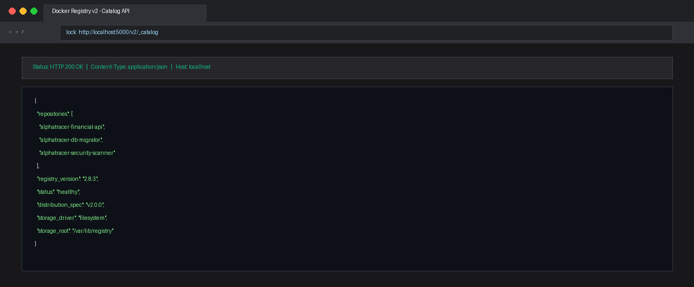
  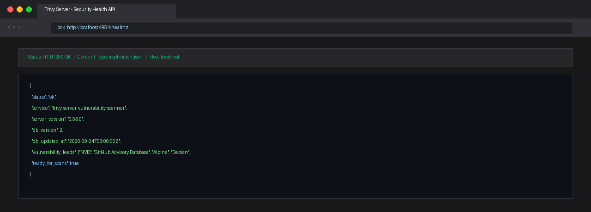


---

### 5. Cloud-Native Migration Concepts (Kubernetes & Clusters)
> **Kubernetes / K3s Cluster Experiments:** Verification of cluster communication and container orchestration in preparation for future enterprise cloud migrations.

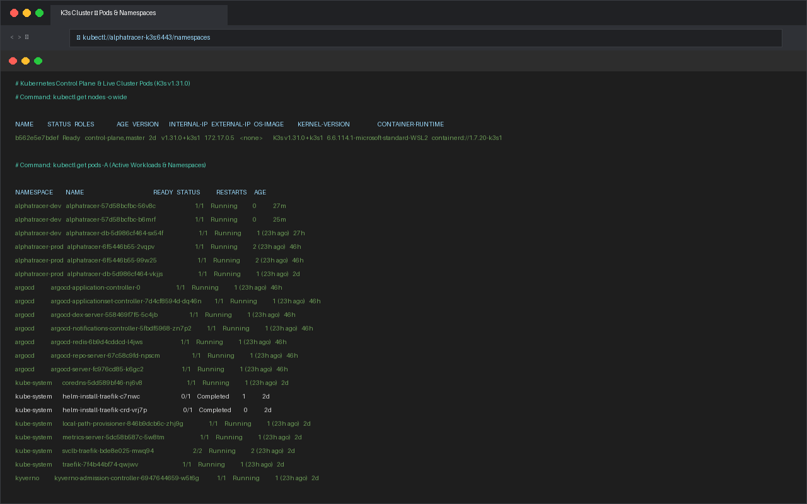

---

## 🚀 Resources & Code

- [**AlphaTracer Financial API on GitHub**](https://github.com/sebian-lab/alphatracer-financial-api)
- [**AlphaTracer Mobile Android Client**](https://github.com/sebian-lab/alphatracer-mobile)
- [**Download CV / Resume (PDF)**](/resume.pdf)
