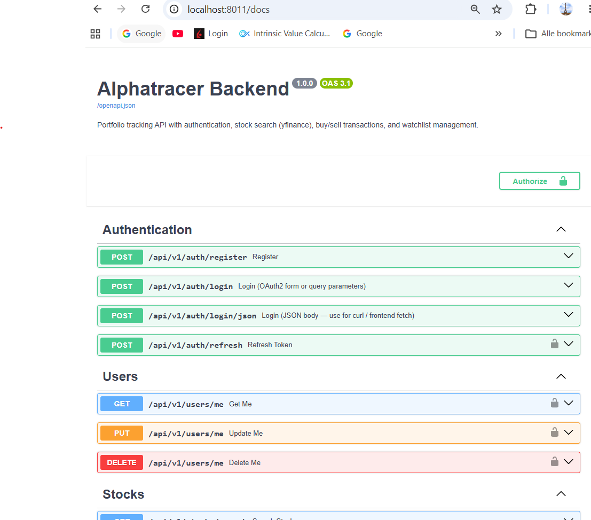

**Skills Demonstrated:** FastAPI, Python 3.10+, Docker Compose, PostgreSQL, Redis, REST API Architecture, JWT Authentication & Refresh Tokens, Rate Limiting, Automated DevSecOps Pipelines (Bandit SAST & Trivy Vulnerability Scanning), Staging Promotion, E2E Test Automation, Observability & Container Health Monitoring.

---

## 📖 Interactive API Documentation (Swagger / OpenAPI)

---

## 🏛️ System Overview

The **AlphaTracer Financial API** is a production-grade, asynchronous REST API gateway that powers the AlphaTracer stock tracking and portfolio management ecosystem. It provides real-time market data ingestion, dynamic portfolio calculations, automated transaction processing, and multi-tenant user authentication.


graph TD
    Client[Client Tier: Android App / Web] -->|TLS / HTTPS| Nginx[Nginx Reverse Proxy & SSL]
    Nginx -->|Reverse Proxy :8011| FastAPI[FastAPI Backend Application]
    FastAPI -->|Caching & Rate Limiting| Redis[(Redis Cache)]
    FastAPI -->|Dynamic SQL / Migrations| Postgres[(PostgreSQL Database)]
    FastAPI -->|Financial Data Stream| YFinance[Yahoo Finance Stream]
    
    subgraph "DevSecOps & Observability Pipeline"
        Bandit[Bandit SAST Scanner] -.-> CI[GitHub Actions CI/CD]
        Trivy[Trivy Container Scanner] -.-> CI
        E2E[E2E Verification Suite] -.-> CI
        CI --> Staging[Automated Staging Promotion]
    end


---

## ✨ Key Features & Capabilities

- **Real-Time Financial Engine:** Asynchronous stock price retrieval, technical indicators, and dynamic portfolio profit/loss computations.
- **Robust Authentication & Security:** JWT tokens with secure refresh token rotation, bcrypt password hashing, and endpoint rate limiting (5 attempts/min on auth endpoints).
- **Streamlined Observability:** Integrated health-check and metrics endpoints (`/api/v1/health`, `/metrics`) providing container status, database connectivity, and latency monitoring.
- **Enterprise DevSecOps Pipeline:**
  - **Bandit (SAST):** Automated static code analysis for security vulnerabilities on every pull request.
  - **Trivy (Container Security):** Automated vulnerability scanning for base image packages and CVEs before deployment.
  - **Automated Staging Promotion:** Automated container image tagging and promotion from `dev` to `staging` environments.
- **Comprehensive E2E Test Suite (`test_deployment_to_running.sh`):** Automated end-to-end verification script testing the entire lifecycle: container boot, database migrations, authentication, watchlist CRUD, and market data queries.

---

## 🛠️ Tech Stack & Architecture

| Component | Technology | Role |
| :--- | :--- | :--- |
| **Backend Framework** | **FastAPI** (Python 3.10+) | High-throughput async REST endpoints with Pydantic validation |
| **ORM & Database** | **SQLAlchemy** + **PostgreSQL** | Dynamic portfolio and transaction modeling with persistence |
| **Caching & Limiting** | **Redis** | In-memory token blacklisting and rate-limit state |
| **Reverse Proxy** | **NGINX** | SSL/TLS termination, HSTS, and HTTP security headers |
| **Containerization** | **Docker Compose** | Multi-service orchestration and isolated bridge networking |
| **CI/CD & Security** | **GitHub Actions** | Automated linting, pytest, Bandit SAST, Trivy scanning |

---

## 🔒 Security Hardening

- **HTTP Security Headers:** Enforced `Strict-Transport-Security` (HSTS), `X-Frame-Options: DENY`, `X-Content-Type-Options: nosniff`.
- **Dynamic CORS Configuration:** Stricter origin whitelisting avoiding permissive wildcard defaults.
- **Non-blocking Platform Boot:** Optimized platform startup scripts (`setup-platform.ps1`) with fast cluster detection and fail-safes.

---

## 🚀 Repositories & Resources

- [**View AlphaTracer Financial API on GitHub**](https://github.com/sebian-lab/alphatracer-financial-api)
- [**AlphaTracer Mobile Android Client**](https://github.com/sebian-lab/alphatracer-mobile)
- [**Download CV / Resume (PDF)**](/resume.pdf)
