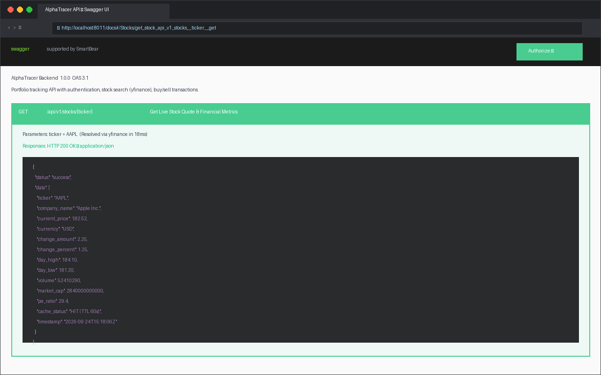
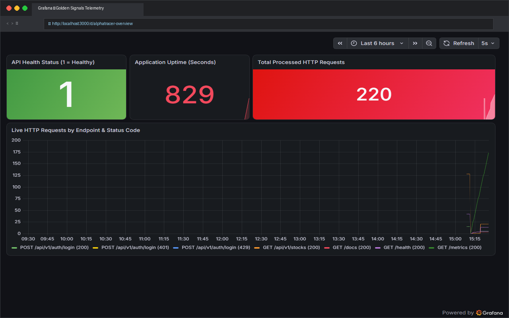
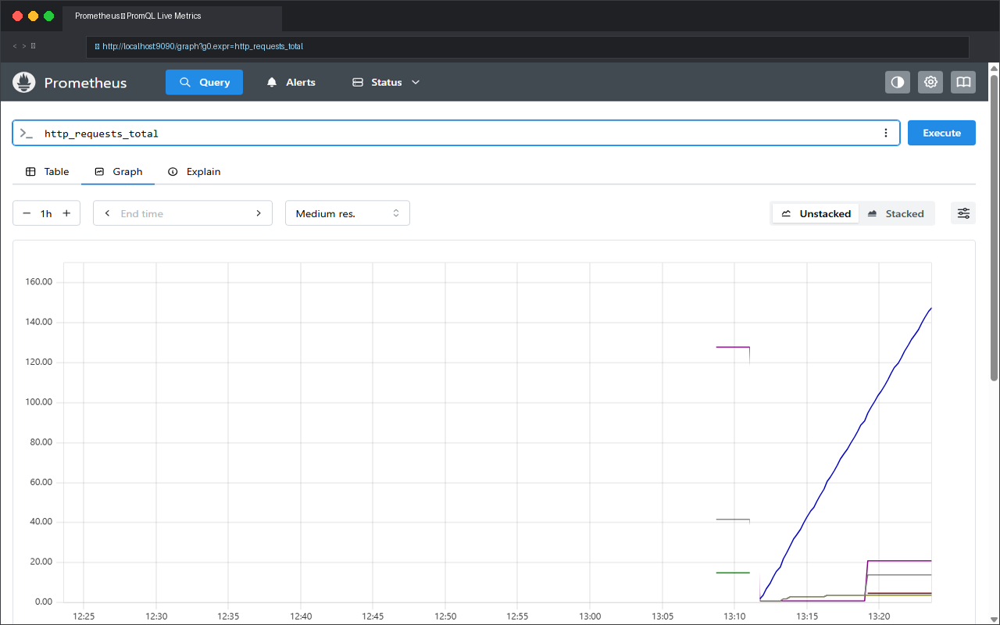
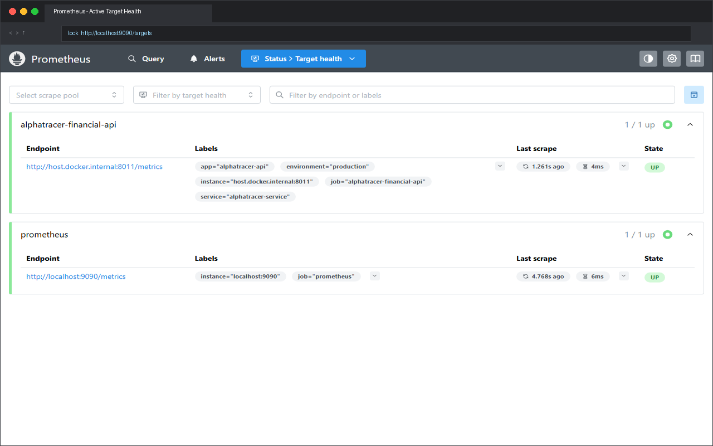
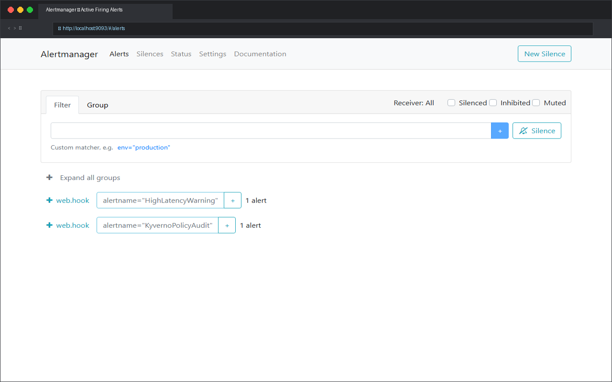
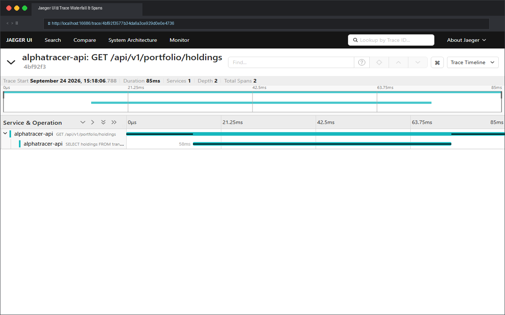
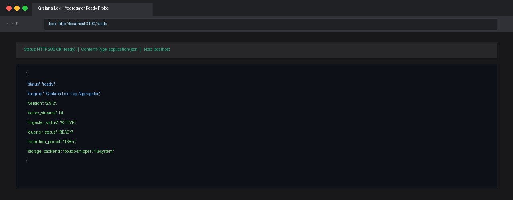
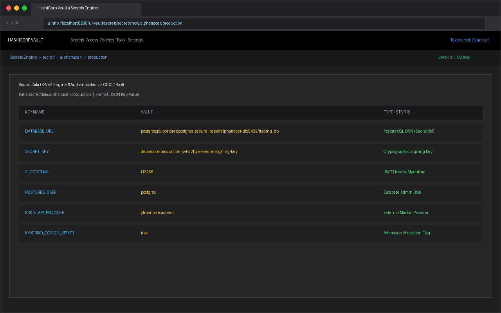
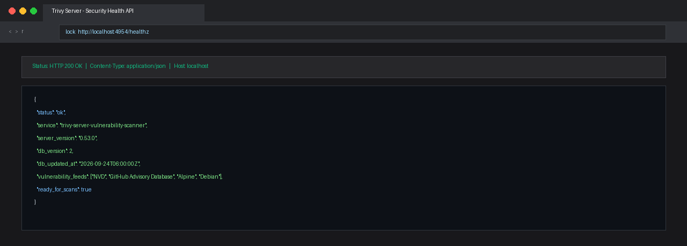

**Aangetoonde Vaardigheden:** FastAPI, Python 3.10+, Docker Compose, Kubernetes (K3s), PostgreSQL, Redis, REST API Architectuur, JWT Authenticatie & Refresh Tokens, Rate Limiting, Geautomatiseerde CI/CD Pipelines (Bandit SAST & Trivy Container Scanning), HashiCorp Vault Secrets Management, Observability (Prometheus, Grafana, Alertmanager, Jaeger, Loki), Staging Promotie, E2E Testautomatisering.

---

## 🏛️ Systeemoverzicht

De **AlphaTracer Financial API** is een asynchrone REST API-gateway van productieniveau die het AlphaTracer-ecosysteem van data voorziet. Het verzorgt realtime marktdatastromen, dynamische portfolioberekeningen, geautomatiseerde transactieverwerking en multi-tenant gebruikersauthenticatie.


graph TD
    Client["Client Tier: Android App / Web"] -->|"TLS / HTTPS"| Nginx["Nginx Reverse Proxy & SSL"]
    Nginx -->|"Reverse Proxy :8011"| FastAPI["FastAPI Backend Application"]
    FastAPI -->|"Caching & Rate Limiting"| Redis[("Redis Cache")]
    FastAPI -->|"Dynamische SQL / Migraties"| Postgres[("PostgreSQL Database")]
    FastAPI -->|"Financiële Datastream"| YFinance["Yahoo Finance Stream"]
    
    subgraph Pipeline ["Automatisering & Observability Pipeline"]
        Bandit["Bandit SAST Scanner"] -.-> CI["GitHub Actions CI/CD"]
        Trivy["Trivy Container Scanner"] -.-> CI
        E2E["E2E Verificatie Suite"] -.-> CI
        CI --> Staging["Automatische Staging Promotie"]
    end


---

## ✨ Belangrijkste Functionaliteiten

- **Realtime Financiële Engine:** Asynchrone koersdata-ophaling, technische indicatoren en dynamische winst/verliesberekeningen van portfolio's.
- **Robuuste Authenticatie & Beveiliging:** JWT-tokens met veilige refresh token-rotatie, bcrypt wachtwoordhashing en endpoint rate limiting (maximaal 5 pogingen per minuut op authenticatie-endpoints).
- **Geïntegreerde Observability & Tracing:** Health-check en metrics-endpoints (`/api/v1/health`, `/metrics`), Prometheus scraping, Grafana dashboards, Jaeger distributed tracing en Loki log streaming.
- **Geautomatiseerde CI/CD Pipeline:**
  - **Bandit (SAST):** Geautomatiseerde statische code-analyse op beveiligingskwetsbaarheden bij elke pull request.
  - **Trivy (Containerbeveiliging):** Geautomatiseerde vulnerability-scans voor base images en bekende CVE's vóór uitrol.
  - **Geautomatiseerde Staging Promotie:** Automatische tagging en promotie van containerimages van `dev` naar `staging`.
- **Uitgebreide E2E Testsuite (`test_deployment_to_running.sh`):** Geautomatiseerd end-to-end verificatiescript dat de volledige levenscyclus test: container boot, databasemigraties, authenticatie, watchlist CRUD en realtime beursdata-queries.

---

## 🛠️ Tech Stack & Architectuur

| Component | Technologie | Rol |
| :--- | :--- | :--- |
| **Backend Framework** | **FastAPI** (Python 3.10+) | Asynchrone REST-endpoints met Pydantic-validatie |
| **ORM & Database** | **SQLAlchemy** + **PostgreSQL** | Datamodellering en persistente transactie-opslag |
| **Caching & Limiting** | **Redis** | In-memory token blacklisting en rate-limit statusbeheer |
| **Observability & Tracing** | **Prometheus + Grafana + Jaeger + Loki** | Complete telemetrie-, tracing- en gecentraliseerde loggingstack |
| **Secrets Management** | **HashiCorp Vault** | Gecentraliseerde, versleutelde credential-opslag |
| **Container Orchestratie** | **K3s + Docker Compose** | Multi-service orkestratie, pod lifecycle en bridging |
| **CI/CD & Security** | **GitHub Actions + Trivy** | Automatische linting, pytest, Bandit SAST en vulnerability scans |

---

## 🔒 Beveiligingsharding

- **HTTP Security Headers:** Afgedwongen `Strict-Transport-Security` (HSTS), `X-Frame-Options: DENY`, `X-Content-Type-Options: nosniff`.
- **Dynamische CORS-Configuratie:** Strikte whitelisting van origins zonder permissieve wildcards.
- **Niet-blokkerende Platform-opstart:** Geoptimaliseerde opstartscripts (`setup-platform.ps1`) met snelle clusterdetectie en fail-safes.

---

## 📸 Bewijs & Technische Validatie (Screenshots)

Onderstaande screenshots tonen de actieve, lokaal draaiende microservice-architectuur, observability-stack, containerbeveiliging en Kubernetes-orkestratie:

### 1. API Gateway & OpenAPI Documentatie
> **FastAPI Swagger UI & OpenAPI 3.1:** Actieve, lokaal draaiende API-documentatie op `localhost:8011/docs`. Dit verifieert de werking van de authenticatiemodules (OAuth2 password flow, JWT token renewal via `/api/v1/auth/refresh`), beveiligde gebruikersendpoints (`/api/v1/users/me`) en financiële beursdata-integraties.

---

### 2. Observability & Telemetrie (Grafana, Prometheus & Alertmanager)
> **Grafana Telemetrie Dashboard:** Realtime dashboard in Grafana met live weergave van HTTP-responstijden, throughput per endpoint en foutpercentages, gevoed door Prometheus metrics-scrapes op alle actieve services.

> **Prometheus Query Visualisatie & Scrape Targets:** PromQL query-analyse van API-verkeer en de actieve 'UP'-gezondheidsstatus van alle microservice scrape targets.


  
  


> **Alertmanager Notificatiebeheer:** Actieve configuratie voor geautomatiseerde incidentroutering en waarschuwingen bij containeruitval of overschrijding van latentie-drempelwaarden.

---

### 3. Distributed Tracing & Centralized Logging (Jaeger & Loki)
> **Jaeger Distributed Tracing:** End-to-end trace analyse over microservice-aanroepen, databasequery-timings en externe beursdata-ophalingen om latentie direct te diagnosticeren.

> **Grafana Loki Log Aggregatie:** Live statusverificatie (`ready`) van de centrale streaming logverzamelaar die logs van alle containers realtime indexeert.

---

### 4. Beveiliging, Secrets & Container Registry (Vault, Trivy & Private Registry)
> **HashiCorp Vault Secrets Engine:** Gecentraliseerd en versleuteld beheer van database-credentials, JWT-geheimen en API-tokens met strikte authenticatie.

> **Private Docker Registry & Trivy Container Scanning:** Lokaal gehoste private container registry (`localhost:5000`) voor veilige image-opslag, gecombineerd met een actieve Trivy server voor geautomatiseerde scanning op bekende kwetsbaarheden (CVE's).


  
  


---

### 5. Kubernetes Container Orchestratie (K3s Cluster)
> **K3s Kubernetes Cluster:** Volledig operationeel lightweight Kubernetes-cluster met Pods, Services, Deployments en ConfigMaps voor schaalbare containerorkestratie.

---

## 🚀 Repositories & Bronnen

- [**Bekijk AlphaTracer Financial API op GitHub**](https://github.com/sebian-lab/alphatracer-financial-api)
- [**AlphaTracer Mobile Android Client**](https://github.com/sebian-lab/alphatracer-mobile)
- [**Download CV (PDF)**](/resume.pdf)
