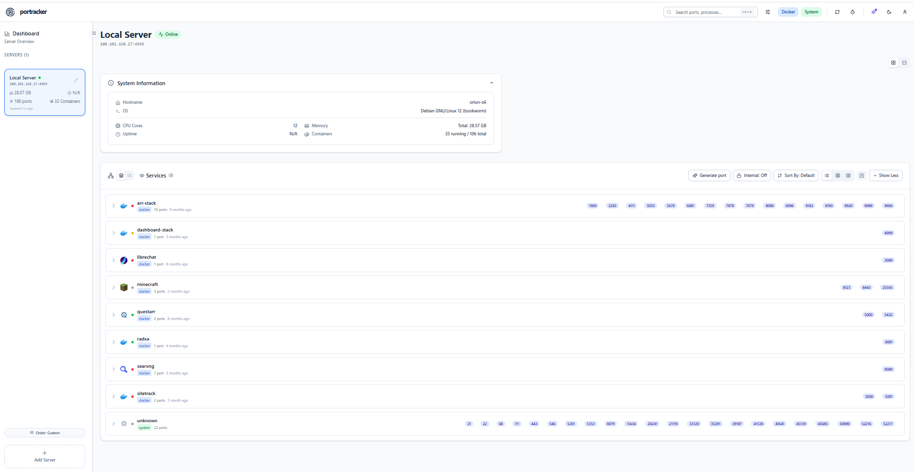

**Skills Demonstrated:** Zero-Trust Network Architecture (ZTNA), Tailscale (WireGuard Mesh VPN, Subnet Routers, Exit Nodes, ACL Policies), Distributed AI Inference (9-GPU Cluster, 50+ GB VRAM, llama.cpp, GGUF/Layer Splitting), Docker Compose (30+ active containers), Linux System Administration (Debian 12 Bookworm, systemd, ufw), Reverse Proxying & SSL Termination (Nginx/Traefik), Database Administration (PostgreSQL with VectorChord, Redis, Valkey, MongoDB), System & Port Monitoring (PortTracker).

---

## 🖥️ Live Homelab Overview

`orion-o6` is a 24/7 dedicated production homelab server running **Debian GNU/Linux 12 (bookworm)** equipped with 12 CPU cores and 28.57 GB RAM. It orchestrates over 30 microservices covering AI/LLM workloads, self-hosted search, media pipelines, automated continuous data synchronization, and internal infrastructure telemetry.

  

    

      🖥️
      <strong style="color:#58a6ff; font-size:16px;">orion-o6 & Cluster Telemetry</strong>
    

    ● 24/7 Production Node
  

  

    

      
Host System

      
Debian 12 (12 Cores / 28 GB)

    

    

      
GPU Compute Node

      
9-GPU Cluster (50+ GB VRAM)

    

    

      
Active Containers

      
33 Running Services

    

    

      
Mesh Network

      
Tailscale Zero-Trust (20 Nodes)

    

  

---

## 🔒 Tailscale Zero-Trust Mesh Architecture

Rather than opening vulnerable public inbound ports on residential/WAN firewalls or exposing services via legacy dynamic DNS, the homelab implements a modern **Zero-Trust Network Access (ZTNA)** topology powered by **Tailscale (WireGuard)**.


graph TD
    subgraph "Client Tier: Authenticated Remote Endpoints"
        DevPC[Workstations & Laptops]
        Mobile[Mobile Devices - iOS/Android]
    end

    subgraph "Tailscale Encrypted WireGuard Mesh (Tailnet)"
        Router1["orion-o6 (100.101.x.x) Subnet Router & Exit Node"]
        Router2["Secondary Node (100.88.x.x) Redundant Subnet Router"]
        GPUCluster["ubunt (100.113.x.x) ⚡ 9-GPU LLM Inference Cluster 50+ GB VRAM / llama.cpp Server"]
    end

    subgraph "Internal Application & AI Ecosystem (orion-o6)"
        NginxProxy[Nginx / Traefik Reverse Proxy]
        Containers["Docker Bridge Network • AI Workloads: LibreChat, Open-WebUI • RAG Pipeline: rag_api, pgvector, Meilisearch • Photo & ML: Immich Server & ML VectorChord • Media & Automation: Jellyfin, n8n, Questarr • Databases: PostgreSQL 16 & 17, Redis, Valkey"]
        Monitoring[PortTracker Telemetry Engine]
    end

    DevPC == "Encrypted WireGuard Peer-to-Peer" ==> Router1
    Mobile == "Encrypted WireGuard Peer-to-Peer" ==> Router1
    DevPC -.-> Router2

    Router1 --> NginxProxy
    NginxProxy --> Containers
    Containers --> Monitoring

    %% Interconnection between orion-o6 AI frontends and 9-GPU cluster
    Containers <== "High-Speed Internal Tailnet Mesh (OpenAI-Compatible API)" ==> GPUCluster

    style Router1 fill:#1e3a8a,stroke:#3b82f6,stroke-width:2px,color:#fff
    style Router2 fill:#1e3a8a,stroke:#3b82f6,stroke-width:2px,color:#fff
    style GPUCluster fill:#581c87,stroke:#a855f7,stroke-width:2px,color:#fff
    style Containers fill:#1e293b,stroke:#475569,color:#fff


### 1. Cross-Platform 20-Node Tailnet
- **Multi-OS Mesh:** The encrypted mesh connects **20 active endpoints** across heterogeneous environments: Debian server hosts, specialized Linux compute nodes, Windows development machines, and mobile devices.
- **NAT Traversal & DERP Fallback:** Leveraging interactive STUN/ICE-style hole punching to establish direct peer-to-peer UDP WireGuard connections across double-NAT configurations without public IP dependencies.

### 2. Subnet Routing & Exit Node Capabilities
- **Subnet Router:** `orion-o6` broadcasts private subnet routes, allowing authorized remote devices on the Tailnet to access internal container networks directly without needing individual VPN clients inside each container.
- **Dedicated Exit Nodes:** Key server nodes are provisioned as full **Exit Nodes**, enabling secure, encrypted routing of all client internet traffic through trusted homelab egress points when on untrusted public Wi-Fi.

### 3. Granular Access Control Policies (ACLs)
- **Principle of Least Privilege:** Configured with declarative Tailscale Access Control Lists (ACLs). Access rules restrict specific users and device tags to only their authorized destination nodes and specific ports.
- **Administrative Isolation:** High-privilege management ports (SSH port 22, database ports, internal API endpoints) are strictly restricted to authenticated administrator devices, preventing lateral movement from lower-trust endpoints.
- **Key Expiry & Machine Posture:** Device authorization requires periodic cryptographic key refresh, ensuring inactive or decommissioned machines are automatically prevented from reconnecting.

### 4. Zero Open Inbound Ports
- **Total Attack Surface Elimination:** The WAN router exposes **0 forwarded ports** to the public internet. All traffic is authenticated, encrypted end-to-end, and verified at the cryptographic level before reaching any service.

---

## ⚡ 9-GPU LLM Inference Cluster (`ubunt`)

A premier component of the network is **`ubunt`** (`100.113.x.x`), a dedicated bare-metal Linux compute node specifically architected as a **distributed 9-GPU LLM inference cluster**:

- **Hardware & VRAM Pool:** Houses **9 discrete GPUs delivering an aggregate pool of over 50 GB VRAM**.
- **Large-Model Hosting (50+ GB Models):** Engineered to run heavy quantized parameter models (such as LLaMA-3 70B, Qwen 72B, Mixtral 8x22B, Command-R+) entirely offloaded across GPU memory without falling back to slow CPU system RAM.
- **High-Throughput Runtime:** Powered by **llama.cpp** server using GPU tensor and layer splitting to maximize memory bandwidth and tokens-per-second generation rates.
- **Seamless Tailnet Integration:** The cluster communicates privately across the Tailscale mesh to `orion-o6`, exposing OpenAI-compatible endpoints directly to internal AI clients (**LibreChat**, **Open-WebUI**, and the **RAG API** pipeline with `pgvector` and `Meilisearch`).
- **Complete Data Sovereignty:** Zero proprietary API dependencies; enterprise-grade intelligence running entirely within a private, self-hosted perimeter.

---

## 📦 Containerized Service Ecosystem (30+ Services on `orion-o6`)

Every workload on `orion-o6` is containerized, segregated into custom Docker bridge networks, and monitored continuously:

| Domain | Key Container Services | Architecture & Purpose |
| :--- | :--- | :--- |
| **AI & LLM Workloads** | `LibreChat`, `open-webui`, `rag_api`, `pgvector`, `chat-mongodb`, `chat-meilisearch` | Private AI assistant interfaces, retrieval-augmented generation (RAG) pipelines, and vector database embeddings connected to the 9-GPU inference node. |
| **Media & ML Pipeline** | `immich_server`, `immich_machine_learning`, `immich_postgres` (VectorChord), `immich_redis` | High-performance self-hosted photo library with local ML facial recognition and vector-based semantic image search. |
| **Media Automation** | `jellyfin`, `jellyseerr`, `radarr`, `radarr-4k`, `sonarr`, `prowlarr`, `qbittorrent`, `unpackerr` | Full-stack automated media streaming and request management platform. |
| **Databases & Caching** | `postgres:16-alpine`, `postgres:17`, `redis:7-alpine`, `valkey:9-alpine` | High-availability persistent relational storage, caching tiers, and session backends. |
| **Automation & Scraping** | `n8n`, `changedetection`, `browserless/chrome`, `searxng-core` | Automated webhook workflows, headless browser rendering, and private meta-search engine. |
| **System & Monitoring** | `portracker`, `webtop`, `debian_web_stream`, `librespeed`, `wealthfolio` | Real-time port mapping telemetry, secure web-based browser streaming, and system performance diagnostics. |

---

## 🔍 Continuous Telemetry with PortTracker

To monitor all 30+ services across **22+ exposed internal ports**, `orion-o6` runs **PortTracker**. As shown in the dashboard screenshot above:
- **Port Conflict Detection:** Tracks service allocations across stacks (`arr-stack`, `dashboard-stack`, `librechat`, `questarr`, `sitetrack`).
- **Health Checks & Status:** Instant detection of container degradation or unhealthy state loops.
- **Tailnet Internal Binding:** Confirms services bind to internal Tailscale IP interfaces (`100.101.x.x`) and local bridge networks rather than all-interfaces public listeners.

---

## 💡 Why This Matters for Cloud & Security Roles

Operating this production homelab provides daily, practical mastery of enterprise infrastructure requirements:
- **Zero-Trust Network Defense:** Implementing WireGuard mesh networking, least-privilege ACL rules, and zero-inbound-port architectures.
- **Advanced AI Infrastructure:** Deploying and operating multi-GPU clusters, VRAM pooling, and tensor-parallel inference pipelines.
- **Infrastructure Reliability & High Availability:** Maintaining 24/7 uptime across multi-tier applications, storage volumes, and database migrations.
